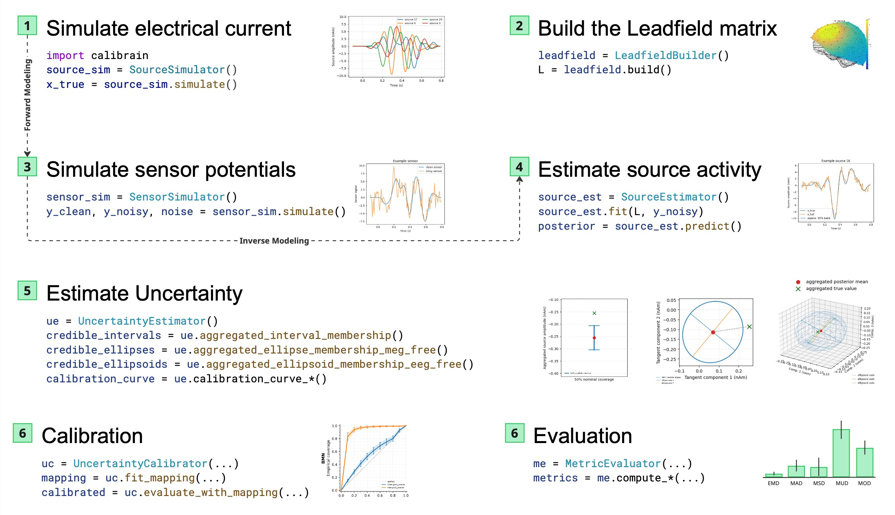
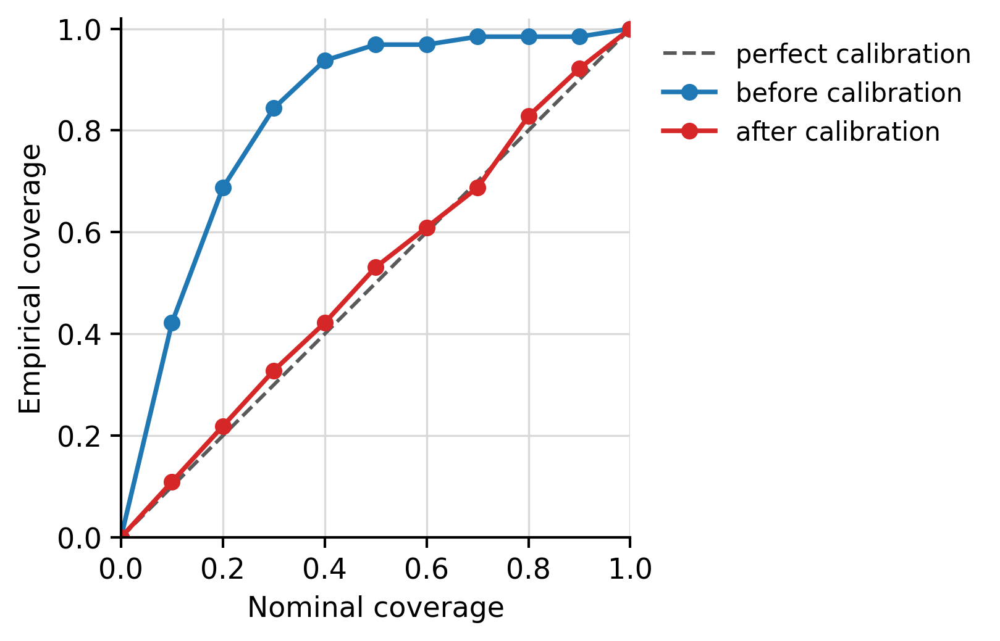

<!-- # CaliBrain -->
<!--  width="220" -->

<p align="center">
  
</p>

[](https://pypi.org/project/calibrain/)
[](https://pypi.org/project/calibrain/)
[](https://github.com/braindatalab/CaliBrain/actions/workflows/tests.yml)
[](https://github.com/braindatalab/CaliBrain/blob/main/LICENSE)
[](https://github.com/braindatalab/CaliBrain/releases)
[](https://doi.org/10.5281/zenodo.21261767)

CaliBrain: A Python toolbox for uncertainty estimation and calibration in EEG/MEG inverse source imaging.

## Overview

Inverse source imaging is an ill-posed problem: different source
configurations can explain the same sensor data. CaliBrain addresses a central
question in Bayesian source imaging: are posterior uncertainty estimates
empirically reliable? The toolbox provides simulation-based workflows for
generating source activity, propagating it through forward models,
reconstructing posterior source estimates, quantifying empirical coverage, and
evaluating recalibration maps under controlled experimental conditions.

<p align="center">
  
</p>

## Documentation

The documentation is hosted on Read the Docs:
https://calibrain.readthedocs.io/

For runnable end-to-end examples, see the tutorials and workflow
documentation on Read the Docs.

## Citation

If you use CaliBrain in academic work, please cite the software archive:

`Orabe, Mohammad, Huseynov, Ismail T., Nagarajan, Srikantan, & Haufe, Stefan. (2026). CaliBrain: A Python toolbox for uncertainty estimation and calibration in EEG/MEG inverse source imaging (v1.0.3). Zenodo. https://doi.org/10.5281/zenodo.21261767`

## Example

The example below simulates one inverse problem, reconstructs sources, and
plots empirical coverage before and after isotonic recalibration.

Simulate source activity:

```python
import matplotlib.pyplot as plt
import numpy as np

from calibrain import (
    BMN,
    LeadfieldBuilder,
    SensorSimulator,
    SourceEstimator,
    SourceSimulator,
    UncertaintyCalibrator,
    UncertaintyEstimator,
)

# Simulate a small fixed-orientation inverse problem.
x_true, _ = SourceSimulator().simulate(n_sources=64, nnz=4, seed=0)

# Build a random leadfield, simulate sensor data, and reconstruct sources.
L = LeadfieldBuilder(leadfield_dir="unused").get_leadfield(
    retrieve_mode="random",
    orientation_type="fixed",
    n_sensors=20,
    n_sources=x_true.shape[0],
)
_, y_noisy, noise, _ = SensorSimulator().simulate(x_true, L, seed=0)
result = SourceEstimator(solver=BMN, noise_var=float(np.var(noise))).fit(L, y_noisy).predict()

# Compute calibration curves before and after isotonic recalibration.
nominal_coverages = np.linspace(0.0, 1.0, 11)
uncertainty = UncertaintyEstimator(nominal_coverages=nominal_coverages)
calibrator = UncertaintyCalibrator(nominal_coverages=nominal_coverages)
posterior_var = uncertainty.posterior_variance_from_cov(result["posterior_cov"])

pre_curve = uncertainty.calibration_curve_intervals_aggregated(
    x_true=x_true,
    x_hat=result["posterior_mean"],
    posterior_var=posterior_var,
)
mapping = calibrator.fit_mapping(
    x_true=x_true,
    x_hat=result["posterior_mean"],
    posterior_var=posterior_var,
)
post_curve = calibrator.evaluate_with_mapping(
    x_true=x_true,
    x_hat=result["posterior_mean"],
    posterior_var=posterior_var,
    mapping=mapping,
)

# Plot nominal vs empirical coverage.
plt.plot([0, 1], [0, 1], "--", color="0.5", label="perfect calibration")
plt.plot(pre_curve["nominal_coverages"], pre_curve["empirical_coverages"], "o-", label="before calibration")
plt.plot(post_curve["nominal_coverages"], post_curve["empirical_coverages"], "o-", label="after calibration")
plt.xlabel("Nominal coverage")
plt.ylabel("Empirical coverage")
plt.legend()
plt.tight_layout()
plt.show()
```

<p align="center">
  
</p>

## Workflow

The package follows this workflow:

1. generate source-level ground truth under controlled sparsity and amplitude assumptions;
2. project sources to sensors through a leadfield and add noise at defined SNR;
3. reconstruct posterior means and uncertainty summaries with inverse solvers;
4. convert uncertainty summaries into intervals, ellipses, or ellipsoids;
5. compare empirical against nominal coverage;
6. fit isotonic recalibration functions on training splits and evaluate them on held-out splits.

CaliBrain currently supports fixed and free-orientation source models for inverse source imaging methods:
- `gamma_map_sflex` for Gamma-MAP reconstruction with sparse basis field expansions;
- `gamma_lambda_map_sflex` for the S-FLEX Gamma-MAP variant with joint sparsity and lambda regularization;
- `BMN` as a Bayesian minimum norm baseline;
- `BMN_joint` as a Bayesian minimum norm variant with joint gamma/lambda learning.

## Relationship to related software

CaliBrain complements broader neurophysiology analysis libraries, general
uncertainty-calibration toolkits, and standard inverse-solver workflows rather
than replacing them.

Its scope is narrower and more specific: CaliBrain focuses on simulation-based
uncertainty estimation and calibration for EEG/MEG inverse source imaging,
including source-level intervals, local covariance-based ellipsoids, empirical
coverage analysis, and recalibration across controlled evaluation conditions.

## Installation

From PyPI:

```bash
python -m pip install calibrain
```

From a local checkout:

```bash
git clone https://github.com/braindatalab/CaliBrain.git
cd CaliBrain
python -m pip install -e .
```

## Contributing

Contribution guidelines are available in `CONTRIBUTING.md`.
The full development guide is also available in the documentation.

## License

CaliBrain is distributed under the BSD 3-Clause License. See `LICENSE`.
