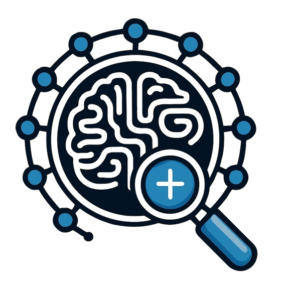

.. TODO: Convert this to readme.rst format:

=========
CaliBrain
=========

Uncertainty Calibration in Brain Source Imaging
===============================================

.. |commits| image:: https://badgen.net/github/commits/braindatalab/CaliBrain/main
   :target: https://github.com/braindatalab/CaliBrain/commits/main?icon=github&color=green
   :alt: commits

.. |docs-latest| image:: https://readthedocs.org/projects/calibrain/badge/?version=latest
   :target: https://calibrain.readthedocs.io/en/latest/?badge=latest
   :alt: Documentation (latest)

|commits| |docs-latest|

----

Overview
========

**CaliBrain** is a Python framework for uncertainty estimation and calibration in EEG/MEG inverse source imaging.

It supports both:

- **Regression** (continuous source estimates)
- **Classification** (binary activation detection)

**Key Features**:

- Setup of source space, BEM model, forward solution, and leadfield matrices.
- Simulation of source activity and sensor-level measurements with controllable noise and source orientation (fixed or free).
- Solving the inverse problem and reconstructing source time courses.
- Estimation and visualization of confidence intervals.
- Calibration analysis by comparing expected vs. observed confidence levels.

Supported Inverse Methods
--------------------------

- Gamma-MAP
- eLORETA
- Bayesian Minimum Norm

----

Calibration Tasks
=================

1. Regression (Confidence Interval Calibration)
------------------------------------------------

- Check if true simulated source currents fall within predicted confidence intervals.
- Plot calibration curve (Expected vs. Observed coverage).
- Well-calibrated models should follow the diagonal.

2. Classification (Activation Calibration)
-------------------------------------------

- Assess if estimated activation probabilities match true activation frequencies.
- Plot calibration curve for activation detection.
- Ideal calibration follows the diagonal.

----

Main Parameters
===============

- **Estimator**: Gamma-MAP, eLORETA, Bayesian Minimum Norm
- **Orientation**: Fixed or Free
- **Noise Type**: Oracle, Baseline, Cross-Validation, Joint Learning
- **SNR Level (α)**: Control regularization strength
- **Active Sources (nnz)**: Number of nonzero sources

.. image:: docs/images/un-ca-param.jpg
   :alt: un-ca-param
   :width: 75%
   :align: center

----

Outcomes
========

- **Regression Calibration Curves** (confidence intervals)
- **Classification Calibration Curves** (activation probabilities)
- **Quantitative Calibration Metrics**

----

Installation
============

Please see the `Installation Guide <docs/source/installation.rst>`_.

----

Usage
=====

Please see the `Usage Guide <docs/source/usage.rst>`_.

----

Contributing
============

We welcome contributions! Please see `CONTRIBUTING.md <docs/source/contributing.rst>`_.

----

License
=======

This project is licensed under the GNU Affero General Public License v3.0. See `LICENSE <LICENSE>`_.

----

Citation
========

If you use CaliBrain, please cite relevant works in EEG/MEG source imaging and uncertainty quantification.