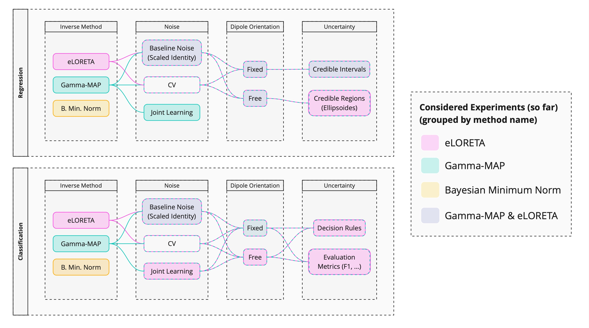

.. CaliBrain documentation master file

=======================
CaliBrain Documentation
=======================

**CaliBrain** is a Python framework for uncertainty estimation and calibration in EEG/MEG inverse source imaging.

.. .. image:: _static/caliBrain.png
..    :alt: CaliBrain Logo
..    :width: 25%
..    :align: center

.. |commits| image:: https://badgen.net/github/commits/braindatalab/CaliBrain/main
   :target: https://github.com/braindatalab/CaliBrain/commits/main?icon=github&color=green
   :alt: commits

.. |docs-latest| image:: https://readthedocs.org/projects/calibrain/badge/?version=latest
   :target: https://calibrain.readthedocs.io/en/latest/?badge=latest
   :alt: Documentation (latest)

|commits| |docs-latest|

.. toctree::
   :maxdepth: 2
   :caption: Installation
   :hidden:

   installation/README

.. toctree::
   :maxdepth: 2
   :caption: Documentation
   :hidden:

   documentation/README

.. toctree::
   :maxdepth: 2
   :caption: Development
   :hidden:

   development/README

.. toctree::
   :maxdepth: 2
   :caption: API Reference
   :hidden:

   api/README

Overview
========

CaliBrain supports both:

- **Regression** (continuous source estimates)
- **Classification** (binary activation detection)

**Key Features**:

- Setup of source space, BEM model, forward solution, and leadfield matrices
- Simulation of source activity and sensor-level measurements with controllable noise and source orientation (fixed or free)
- Solving the inverse problem and reconstructing source time courses
- Estimation and visualization of confidence intervals
- Calibration analysis by comparing expected vs. observed confidence levels

Supported Inverse Methods
--------------------------

- Gamma-MAP
- eLORETA
- Bayesian Minimum Norm

Calibration Tasks
=================

1. Regression (Confidence Interval Calibration)
------------------------------------------------

- Check if true simulated source currents fall within predicted confidence intervals
- Plot calibration curve (Expected vs. Observed coverage)
- Well-calibrated models should follow the diagonal

2. Classification (Activation Calibration)
-------------------------------------------

- Assess if estimated activation probabilities match true activation frequencies
- Plot calibration curve for activation detection
- Ideal calibration follows the diagonal

Main Parameters
===============

- **Estimator**: Gamma-MAP, eLORETA, Bayesian Minimum Norm
- **Orientation**: Fixed or Free
- **Noise Type**: Oracle, Baseline, Cross-Validation, Joint Learning
- **SNR Level (α)**: Control regularization strength
- **Active Sources (nnz)**: Number of nonzero sources

Outcomes
========

- **Regression Calibration Curves** (confidence intervals)
- **Classification Calibration Curves** (activation probabilities)
- **Quantitative Calibration Metrics**

Package Components
==================

CaliBrain is built around a modular architecture:

- :class:`~calibrain.LeadfieldBuilder` - Creates forward models
- :class:`~calibrain.SourceSimulator` - Generates brain activity
- :class:`~calibrain.SensorSimulator` - Simulates measurements
- :class:`~calibrain.SourceEstimator` - Solves inverse problems
- :class:`~calibrain.UncertaintyEstimator` - Quantifies uncertainty
- :class:`~calibrain.MetricEvaluator` - Evaluates performance
- :class:`~calibrain.Visualizer` - Creates visualizations
- :class:`~calibrain.Benchmark` - Orchestrates workflows

License and Citation
====================

This project is licensed under the GNU Affero General Public License v3.0. 
See `LICENSE <https://github.com/braindatalab/CaliBrain/blob/main/LICENSE>`_.

If you use CaliBrain in your research, please cite relevant works in EEG/MEG 
source imaging and uncertainty quantification.

Indices and Tables
==================

* :ref:`genindex`
* :ref:`modindex`
* :ref:`search`